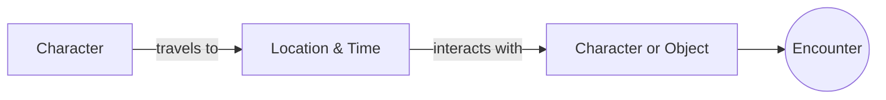
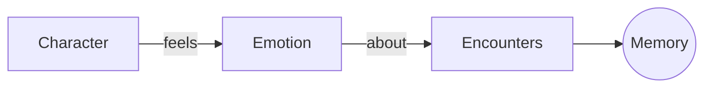
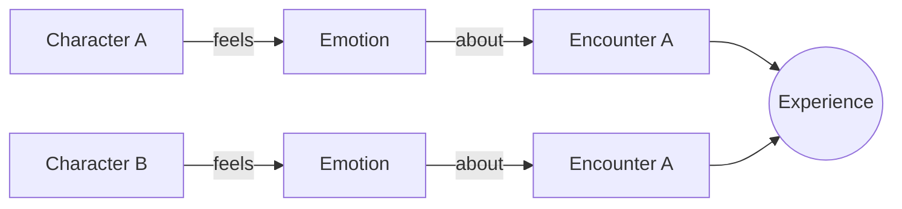

## Encounters 
A character travels to a location at a specific time and interacts with an object or character

### Examples

 - Lola is under water in the bay at 1PM and discovers a sunken ship
 - Carl walks to the inn at 10 AM and has conversation with Matt

## Memories 
A character feels emotions about an encounter

### Examples

 - Lola is excited about finding the sunken ship 
 - Matt is happy that Carl visited him for a conversation

## Experience 
Two different characters feeling emotion about the same encounter

### Examples

- Matt and Carl are angry at each other because of the disagreement they had during their conversation 

