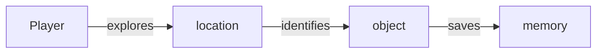
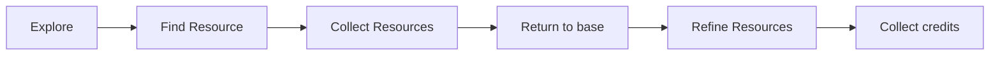

# Game Loops

Different loops the player will experience.

## Learning



## Gathering Resources



``` 
Loot player / structure / vehicle > collect items > Return to base
     > sell items > collect credits  
     > store items in stash > collect items
     > recycle items > collect resources 

Explore > Find destroyed structure / vehicle > Recycle materials > Collect resources

Explore > Find Structure > Hack Structure > Obtain structure ownership
Character Development
Explore > Scan objects > collect information 

Perform skill action  > Gain skill points 

Gain skill points > Gain skill levels 
Combat 
Explore > Find Enemy > Attack Enemy > Loot enemy 

Explore > Find Structure > Attack Structure > Destroy Structure 
```